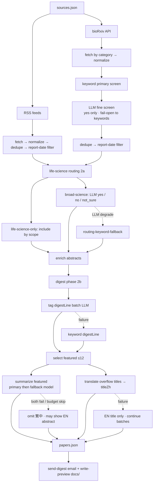

# Paper Digest

Daily **life-science** paper digest: collect journal RSS feeds and bioRxiv preprints, filter with LLM gates, pick up to **12 featured** articles with Traditional Chinese summaries, email subscribers, and publish the same HTML on **GitHub Pages** for preview.

Report date defaults to **yesterday (Asia/Taipei)**.

## What MVP v1 delivers

| Output | Description |
|--------|-------------|
| **Email** | HTML digest via [Resend](https://resend.com): featured cards (EN title, 繁中副標, 繁中摘要, English topic tags) in 主線 A / B / 預印本 sections, plus overflow titles grouped by journal |
| **Public preview** | [`docs/index.html`](docs/index.html) updated by CI — enable Pages from `/docs` on `main` |
| **Data** | `data/processed/{date}/papers.json` — routing stats, digest fields, excluded papers; **30-day rolling retention** on `main` (older daily output pruned by CI) |

## Pipeline



Degrade paths (dashed) never abort the daily run. Papers with routing `no`, enrich drop, digest `skip`, or bioRxiv fine-screen `no`/`not_sure` do not appear in the email body (unless a gate fail-opens and keeps keyword survivors).

## Email layout

**Featured (max 12)** — full card per paper:

- English headline (link)
- 繁中標題 (`titleZh`) if present
- English `topicTags` (when summarize succeeded)
- 繁中摘要 (`summaryZh`) if present; otherwise English abstract with a note
- Grouped by `digestLine`: 單細胞/空間組學 (A), 其他重要生物學 (B), 預印本 (bioRxiv)

**Overflow (13+)** — compact list:

- Grouped by journal; EN title link + gray 繁中標題 when translation ran

## Commands

```bash
npm ci
npm run check
```

| Script | Purpose |
|--------|---------|
| `npm run dev` | Full pipeline → `data/processed/{date}/papers.json` |
| `npm run send-digest` | Email from existing `papers.json` |
| `npm run write-preview` | `docs/index.html` + `docs/archive/{date}.html` |
| `npm run prune-retention` | Remove `data/processed/{date}/` and `docs/archive/{date}.html` older than `--days` (default 30); use `--dry-run` to preview |
| `npm run daily` | `dev` → `send-digest` → `write-preview` |
| `npm run test-routing-llm` | One-paper routing smoke test |
| `npm run test-digest-llm` | One-paper digest tagging smoke test |
| `npm run test:e2e` | Golden + RSS snapshot pipeline tests (mock LLM, no network) |
| `npm run test:regression` | Render-only regression from committed `papers.json` fixtures |
| `npm run test` | All of the above |

Date flag (all three main commands):

```bash
npm run dev -- --date 2026-05-22
npm run send-digest -- --date 2026-05-22 --dry-run
npm run write-preview -- --date 2026-05-22
npm run prune-retention -- --date 2026-07-06 --days 30 --dry-run
```

`test-digest-llm -- --use-routing` uses routing API key/model with digest caps from `config/digest.json`.

### RSS snapshots for tests

Record live feeds once (commit the XML under `test/fixtures/rss-snapshots/{date}/`):

```bash
npm run snapshot-rss -- --date 2026-05-22
npm run snapshot-rss -- --date 2026-05-24
```

Each run writes `{sourceId}.xml` plus `manifest.json` (item counts and how many entries match the report date in Taipei).

E2E tests load these files via `createMockFetch({ reportDate: "2026-05-22" })` — no live RSS, Crossref, or LLM calls.

### E2E acceptance tests

`npm run test:e2e` runs a deterministic golden pipeline:

- Fixture RSS: [`test/fixtures/golden/rss/nature-methods.xml`](test/fixtures/golden/rss/nature-methods.xml)
- Snapshot RSS: [`test/fixtures/rss-snapshots/{date}/`](test/fixtures/rss-snapshots/) (0522 busy day, 0524 empty day)
- Mock LLM responses (routing / tagging / summarize / translate)
- Asserts `papers.json` schema, selection stats, plain-text titles, featured fields, and digest HTML structure

CI runs on every push/PR to `main` (see [`.github/workflows/ci.yml`](.github/workflows/ci.yml)); no API keys required.

### Regression fixtures (render-only)

Real `papers.json` snapshots for render/schema validation without re-running RSS or LLM:

```bash
# After a good local run, refresh fixtures:
npm run export-regression-fixture -- --date 2026-05-22
npm run export-regression-fixture -- --date 2026-05-24
npm run export-regression-fixture -- --date 2026-06-10

npm run test:regression
```

Fixtures live in [`test/fixtures/regression/`](test/fixtures/regression/) (0522: 34 papers / featured 12; 0524: empty day; 0610: busiest day, 64 papers / featured 12).

## Configuration

**Versioned (no secrets)**

| File | Role |
|------|------|
| [`config/sources.json`](config/sources.json) | Feeds: `kind` `rss` or `biorxiv-api`, `scope` (`life-science-only` / `broad-science`), `priority` |
| [`config/biorxiv.json`](config/biorxiv.json) | bioRxiv API categories to ingest |
| [`config/keywords.json`](config/keywords.json) | Keyword fallback for `section` / digest line; bioRxiv primary screen |
| [`config/routing.json`](config/routing.json) | Routing LLM endpoint, batch, tokens |
| [`config/routing-keywords.json`](config/routing-keywords.json) | Title keyword fallback when broad-science LLM gate degrades |
| [`config/digest.json`](config/digest.json) | `maxFeatured`, digest LLM limits, `summarizeConcurrency` |
| [`config/email.json`](config/email.json) | `fromEmail`, `fromName`, `subjectPrefix` (not secrets) |

**Environment (`.env` locally, Secrets in CI)** — copy from [`.env.example`](.env.example):

| Variable | Required | Description |
|----------|----------|-------------|
| `RESEND_API_KEY` | for email | Resend API key |
| `DIGEST_TO_EMAIL` | for email | JSON array or comma-separated recipients |
| `DIGEST_FROM_EMAIL` | no | Override [`config/email.json`](config/email.json) |
| `DIGEST_FROM_NAME` | no | Override display name in `config/email.json` |
| `RESEND_ACCOUNT_EMAIL` | sandbox | Your Resend login; other `DIGEST_TO_EMAIL` addresses skipped until domain verified |
| `DIGEST_SUBJECT_PREFIX` | no | Default `Paper Digest` |
| `ROUTE_LIFE_SCIENCE` | no | `1` to enable routing (on in CI) |
| `ROUTING_LLM_API_KEY` | if routing | Or `NVIDIA_API_KEY` / `OPENAI_API_KEY` |
| `ROUTING_LLM_MODEL` | if routing | Model id (not in repo) |
| `ENABLE_LLM_DIGEST` | no | `1` for LLM tagging + summarize + translate |
| `DIGEST_LLM_API_KEY` | no | Falls back to routing key |
| `DIGEST_LLM_MODEL` | if digest on | Primary digest model (e.g. `minimaxai/minimax-m3` on NVIDIA integrate) |
| `DIGEST_LLM_FALLBACK_MODEL` | no | Featured summarize fallback model (e.g. `gemini-3.1-flash-lite`); unset = fallback off |
| `DIGEST_LLM_FALLBACK_API_KEY` | if fallback on | Gemini API key — **not** the NVIDIA／routing key chain |
| `DIGEST_LLM_FALLBACK_BASE_URL` | no | Default `https://generativelanguage.googleapis.com/v1beta/openai/` |
| `DEBUG_NORMALIZED` | no | `1` for verbose logs |

Digest logs use `[digest]`; routing uses `[routing]`; bioRxiv ingest uses `[biorxiv]` / `[biorxiv-gate]` (not gated by debug).

## GitHub Actions

### CI ([`.github/workflows/ci.yml`](.github/workflows/ci.yml))

Runs on **push** and **pull_request** to `main`:

- `npm run check`
- `npm test` (E2E + regression; mock LLM/RSS only)

Enable branch protection on `main`: require status check **`test`** before merge.

### Daily digest ([`.github/workflows/daily.yml`](.github/workflows/daily.yml))

- **Schedule:** 18:00 Asia/Taipei daily (`workflow_dispatch` supported) — evening run catches more bioRxiv/RSS listings indexed after morning
- **Steps:** resolve date → `dev` → `write-preview` → artifact (`retention-days: 30`) → `prune-retention` (30-day window) → commit (`git add -A data/processed docs`) → `send-digest`

On `main`, only the most recent **30 days** of `data/processed/{date}/` and `docs/archive/{date}.html` are kept in the working tree. Older daily output remains in git history; pinned regression fixtures under `test/fixtures/regression/` are not pruned.

### Repository secrets

| Secret | Required | Notes |
|--------|----------|-------|
| `RESEND_API_KEY` | yes | |
| `DIGEST_TO_EMAIL` | yes | All intended recipients (JSON array); used fully after domain verify |
| `RESEND_ACCOUNT_EMAIL` | yes (sandbox) | Your Resend login email — required while `DIGEST_FROM_EMAIL` is `onboarding@resend.dev` |
| `ROUTING_LLM_API_KEY` | yes | Used for routing; digest can reuse via fallback |
| `ROUTING_LLM_MODEL` | yes | |
| `DIGEST_LLM_MODEL` | recommended | CI falls back to `ROUTING_LLM_MODEL` if unset |
| `DIGEST_LLM_API_KEY` | no | Optional separate primary key |
| `DIGEST_LLM_FALLBACK_MODEL` | no | e.g. `gemini-3.1-flash-lite`; unset = summarize fallback off |
| `DIGEST_LLM_FALLBACK_API_KEY` | if fallback on | Gemini key for featured-summarize fallback only |
| `DIGEST_LLM_FALLBACK_BASE_URL` | no | Optional; code defaults to Gemini OpenAI-compat URL |
| `DIGEST_SUBJECT_PREFIX` | no | Override `config/email.json` if needed |

**Resend sandbox:** `onboarding@resend.dev` only delivers to your account inbox. Set `RESEND_ACCOUNT_EMAIL` to that address; extra recipients in `DIGEST_TO_EMAIL` are skipped (warning in log) until you verify a domain and change `DIGEST_FROM_EMAIL`.

### GitHub Pages (public preview)

1. Repo → **Settings** → **Pages**
2. Source: branch **`main`**, folder **`/docs`**
3. After the next successful daily run, open `https://<user>.github.io/<repo>/`

Archives: `docs/archive/YYYY-MM-DD.html` (rolling **30-day** window on `main`; see daily workflow).

## Local quick start

```bash
cp .env.example .env
# Set RESEND_*, ROUTING_LLM_*, ENABLE_LLM_DIGEST=1, DIGEST_LLM_MODEL=...

npm run daily
# Or step by step:
npm run dev
npm run send-digest -- --dry-run
npm run write-preview
open docs/index.html
```

## Project layout (high level)

```text
src/
  pipeline.ts, index.ts          # orchestration (RSS + bioRxiv → route → enrich → digest)
  routing/                       # Phase 2a life-science gate (LLM + keyword degrade path)
  biorxiv/                       # bioRxiv ingest funnel logs
  biorxiv-gate/                  # preprint LLM fine screen (yes-only; fail-open)
  digest/                        # Phase 2b tag, select, summarize, translate
  llm/                           # shared LLM helpers (JSON extract, response_format fallback, process-wide rate limiter)
  domain/life-science/           # policy: scopes, keywords, digest lines, email copy, registries
  email/                         # Resend + HTML render (shared by email + preview)
  normalizers/                   # RSS per-journal + bioRxiv record → Paper
  enrichers/                     # abstract enrichment registry
  commands/                      # CLI entrypoints
  retention/                     # daily output retention prune
config/                          # sources, biorxiv, keywords, routing(+keywords), digest, email
docs/                            # GitHub Pages (generated HTML)
data/processed/{date}/papers.json  # 30-day rolling retention on main
```

## MVP v1 scope / known limits

- **bioRxiv** is live (`biorxiv-api` in `sources.json`); medRxiv is not wired
- bioRxiv fine screen is yes-only (`not_sure` excluded); LLM failure fail-opens to keyword-matched set so cron is not blocked
- Broad-science routing degrades (missing verdict / timeout / bad JSON) into keyword fallback or `no` — daily digest must still complete
- Digest LLM: tagging/translate failures skip or thin out 繁中 fields; featured summarize uses primary then optional cross-provider fallback (`DIGEST_LLM_FALLBACK_*`, e.g. Gemini) for failed papers only — daily still completes (see `runDigestPhase`)
- **Zero papers** on some weekends/holidays → empty-state email and preview (expected)
- Email and preview share one renderer; no separate “subscriber-only” content
- LLM costs and latency scale with paper count (routing + bioRxiv gate + tagging batches + ≤12 summarize + overflow translate)
- Process-wide LLM request-start rate limiter (`src/llm/llmRequestScheduler.ts`): NVIDIA ~2s and Gemini ~5s start-to-start spacing per quota bucket; every controlled `chat.completions.create` (including probe smoke) queues through the shared transport layer
- `section` from keywords remains in JSON for compatibility; **email uses `digestLine` + `featured`**, not the old three keyword sections

## License / attribution

Private prototype; adjust as needed for your lab or project policy.
